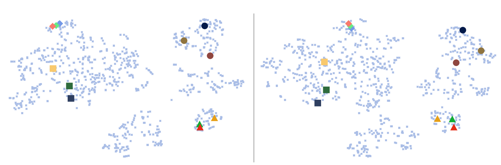

## Few-Shot Image Recognition by Predicting Parameters from Activations

Torch implementation for few-shot learning by predicting parameters from activations:

[Few-Shot Image Recognition by Predicting Parameters from Activations](https://arxiv.org/pdf/1706.03466.pdf)  
[Siyuan Qiao](http://www.cs.jhu.edu/~syqiao/), [Chenxi Liu](http://www.cs.jhu.edu/~cxliu/), [Wei Shen](http://wei-shen.weebly.com/), [Alan Yuille](http://www.cs.jhu.edu/~ayuille/)  
In Conference on Computer Vision and Pattern Recognition (CVPR), 2018 Spotlight

```
@inproceedings{Act2Param,
   title = {Few-Shot Image Recognition by Predicting Parameters from Activations},
   author = {Siyuan Qiao and Chenxi Liu and Wei Shen and Alan L. Yuille},
   booktitle = {CVPR},
   year = {2018}
}
```

### Introduction
Our method is inspired by the close relationship between the activations before the final fully-connected layer which classifies images and the parameters of that fully-connected layer.
We plot the t-SNE results on the average activations of each category before the fully-connected layer of a 50-layer ResNet pre-trained on a subset of ImageNet (left) and the parameters of each category in the last
fully-connected layer (right).
Each point represents a category.
Highlighted points with the same color and shape correspond to the same category.
Circles are mammals, triangles are birds, diamonds are buses, and squares are home appliances.

Comparing them and we observe a high similarity in both the local and the global structures.
More importantly, the semantic structures are also preserved in both activations and parameters, indicating a promising generalizability to unseen categories.
These results suggest the existence of a category-agnostic mapping from the activations to the parameters given a good feature extractor.
In our work, we parameterize this mapping with a feedforward network that is
learned by back-propagation.

### Implementation
We use Torch (and PyTorch for other datasets) to implement our idea.
This repository contains the codes we use to get the performances reported in the paper.
The repository will be organized according to the dataset for easier presentation.
The codes for MiniImageNet dataset are available now (we re-ran the codes on our end several times to make sure the results are reproducible).
The codes for the full ImageNet will also be put here later.
